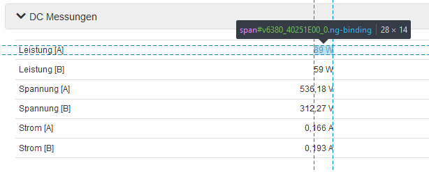

# node-red-contrib-sma-webconnect

Node-RED node to query the Webconnect interface of SMA inverters or storage systems.

## Compatibility
The implementation has been tested with an ethernet connected Sunny Tripower 10.0 but should work with various similiar models. I'm happy to compile a compatiblity list of successfully tested models here.

## Install

```
npm install node-red-contrib-sma-webconnect
```

## Configure

Configure the IP address, user group and password in the node properties. Uncheck the "Use HTTPS connection" checkbox if your device doesn't support HTTPS.


## Example Message Payload

```json
{
  "available_sessions": 3,
  "grid_consumption": 0,
  "grid_feedin": 6546,
  "phase1_voltage": 230.12,
  "phase2_voltage": 231.01,
  "phase3_voltage": 230.55,
  "power": 7608
}
```

## Login sessions
In my testings I've ran into problems with the maximum number of sessions the webserver supports (4 in my case). The node creates a session and reuses that until the node is restarted or the session expires. If you're using a reasonable small interval (I'm using 5 seconds) to query the inverter the session normally shouldn't expire. Otherwise a session expires after around 6,5 hours according to my testings. But it may happen that a created session get's lost when the node is stopped ungracefully. Logins to the web interface via a web browser count against the same session limit as well.

## Network requirements
This node tries to collect the metrics very agressively, i. e.:
* short network timeouts of 1500ms
* timed out requests are retried after 100ms
* retries are attempted 3 times

## Configure Custom Messages

The node already provides basic configurations for Sunny Boy Tripower 8.0/10.0 and Storage 2.5 units. But it is possible to configure the node with an input message to read additional values from your devices.

**The following steps show you how to read custom values from your device**


* `sma_config`: this will tell the node to use the custom configuration, the device selection in the node will be ignored
* `id`: tells the node which message contains the values
* `values`: lists all values that should be read
  * `value_id`: id of values that should be read, this is mandatory!
  * `name`: custom name of read value, this is mandatory!
  * `divider`: sets the divider of the read value (optional)
  * `unit`: unit of value (optional)

`Message id` and `value ids` can easily be found by connecting to the webinterface and using the browsers developer tools to inspect the values displayed on the `/spotvalues` page.

## Example input payload

### Input

```json
{
    "sma_config": {
        "id": "1",
        "values": {
            "6100_0046E500": {
                "name": "phase1_voltage",
                "divider": 100
            },
            "6100_0046E600": {
                "name": "phase2_voltage",
                "divider": 100
            },
            "6100_0046E700": {
                "name": "phase3_voltage",
                "divider": 100
            },
            "6100_40463600": {
                "name": "grid_feedin",
                "divider": 1
            },
            "6100_40463700": {
                "name": "grid_consumption",
                "divider": 1
            },
            "6100_40263F00": {
                "name": "power",
                "divider": 1
            }
        }
    }
}
```

## How to find `message` and `value` id

This section shows you how to get the `message id` and `value ids` the node needs in the input payload to read values from the devices.

1. connect to the webinterface of you device, i.e. `http(s)://192.168.1.42/#/login`
2. got to the overview section of your device, i.e. `http(s)://192.168.1.42#/spotvalues`
3. open your browser developer tools
4. get the `message id` of your device by opening the network tab of the dev tools and selecting the XHR filter
    * select one of the responses from the `/getValues.json` endpoint
    
        * the red is your `message id`, the green a `value id`
5. get the `value id` of your wanted values by using the inspect function of the dev tools
    * open one of the accordeons and search for the values you want to read
    * use the inspection tool to select the displayed value and view the `value id`

      * the value id should be a 13 character long string, in this example it's `6380_40251E00`


